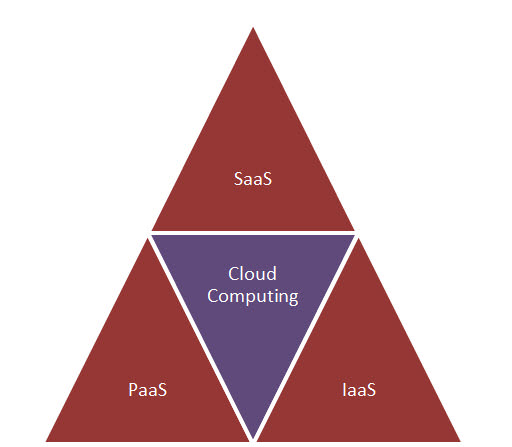

  | 
:-------------------------:|:-------------------------:
 |  

##### Cloud Computing 

### Understanding the Cloud in 360°

 | 
:-------------------------:|:-------------------------:
 |  February 17 - Yaoundé, CM
 

---

### Who am I ? 

 

Boris-Wilfried NYASSE 

 

&#x2713; I am a **Stacker, VP of Engineering** @Stack-Labs
 
   | 
:-------------------------:|:-------------------------:|:-------------------------:|:-------------------------:
 |  |  |  

&#x2713; Google Cloud Architect

&#x2713; Passionate Computer Science Engineer

 

---

### STACK LABS 

---

#### TEAM 

---

### Be Social on Twitter

#### Follow & Tweet

@bwnyasse 

@stack_labs

#stacklabs

---

### Cloud Computing ?

- Have you ever heard about it ? 

- Have you ever use it ? 

---

### Understanding the Cloud 

---

### Understanding the Cloud 

#### How to define it ?

- Any service that runs on the **internet** as opposed to your computer

- Delivering computing power ( **CPU, RAM,Network Speeds, Storage...**) over a network ( usually on the **internet**)

~~physically having the computing resources at the customer location~~

---

### Why the name Cloud ? 

- a **network design** : location of various network devices and there inter-connection

---

### The * As a service 

---

### Initial offer 

 

---

###  Current cloud delivery models 

---

### Don't forget the need of CAAS

  

---

#### The fondamental *aaS Pyramid 
#### using the Cloud Infrastructure

---

#### Why Use the Cloud ? 

---

####  1. Storage

&#x2713;  Unlimited storage capacity

&#x2713;  Back-up and restore data

---

####  2. High Availability

&#x2713;  **Collaboration** in different geographies

&#x2713;  Accessible **Any Time and From Any Location**

---

####  3. Strategic edge

&#x2713;  **Competitive** edge over your competitors

&#x2713;  **Reliability**: get instantly updated about the changes

&#x2713;  **DevOps**: Automatic Software Integration ( CI/CD )

---

####  4. Do more with Less

&#x2713; Companies can reduce the size of their own data centers

 

---

####  5. Flexible costs & cost effective 

&#x2713; **Pay As You Go** or **Pay As You Use**

 

---

#### Types of Cloud computing

Cloud computing is described by both its **deployment model**, as well as **the service that it provides**

---

#### Types of Cloud computing

- **Public Cloud**  : **B2C** type interactions

- **Private Cloud** : owned by **an organization**.

- **Hybrid**

---

#### Public Cloud 

---

#### Global Public Cloud Network 

##### Ex: Google Cloud

---

#### Concept of Availability Zones and Regions

##### Ex: Google Cloud

---

#### Cloud Data Center Locations

##### Ex: Google Cloud

---

#### Migrating to the Cloud

---

#### Lift and Shift Approach

- from **on-prem**  to **cloud compute instances**

- Fast migration vs Technical debt

---

#### Cloud Native Approach

- long-term **redesign** for long-term **benefits**

- Increased risk of vendor lock-in

---

#### Your Journey to the cloud

- Entreprise Foundation 

**IDENTITY - IAM - NETWORK - MONITORING - BILLING**

---

#### Discover some Cloud products 

---

#### GCP with *AAS

---

#### Challenges

---

#### How do you adapt as Developer ?

- Adoption of **Cost Driven Development** ( FinOps ) 

- Continuous learning : **Cloud Expertise**

---

#### African CIOs seek flexible pricing, scalability

- Cloud optimizes costs in emerging markets

- Look to speed time-to-market

- Cloud latency issues remain

---

#### 5 African markets  cloud-ready 

South Africa ,Mauritius, Kenya, Morocco, Tunisia

---

#### 10 African markets  nearly cloud ready

Nigeria, Ghana, Zimbabwe, Zambia, Tanazania, Senegal, Egypt, Ivory Coast, Namibia, Uganda

---

#### Uses and Examples of Cloud Computing

1. **Scalable Usage** : Netflix with streaming service

2. **Chatbots**: Siri, Alexa and Google Assistant - all are cloud-based natural-language intelligent bot

3. **Big Data & Analytics** : Hadoop , Cassandra ...

4. **Productivity & Collaboration** : Google Docs & Office 365

---

#### Uses and Examples of Cloud Computing

5. **Communication**: WhatsApp

6. **Healthcare** : DoctoLib

7. **IOT** : SigFox

8. **CD/CI**: CloudBees, CodeMagic

---

#### THE FUTURE : Hybrid & Multi Cloud

**Google Anthos**

---

